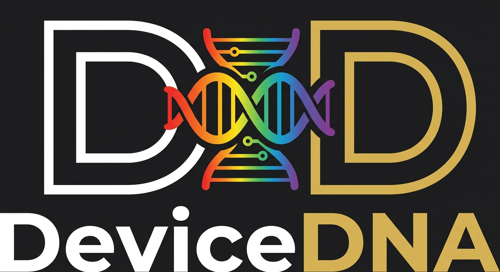
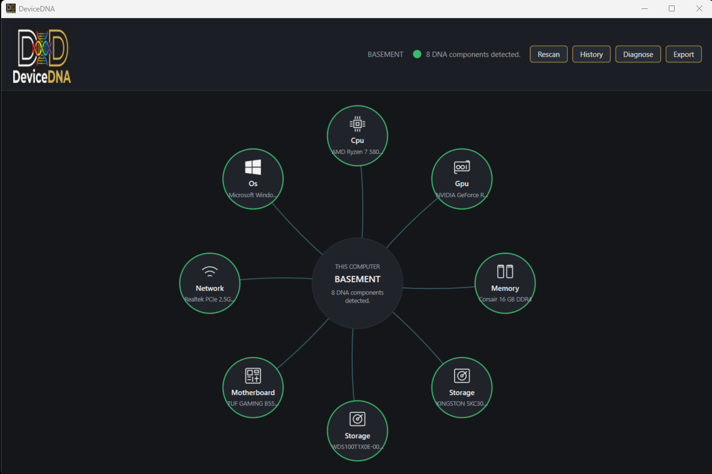
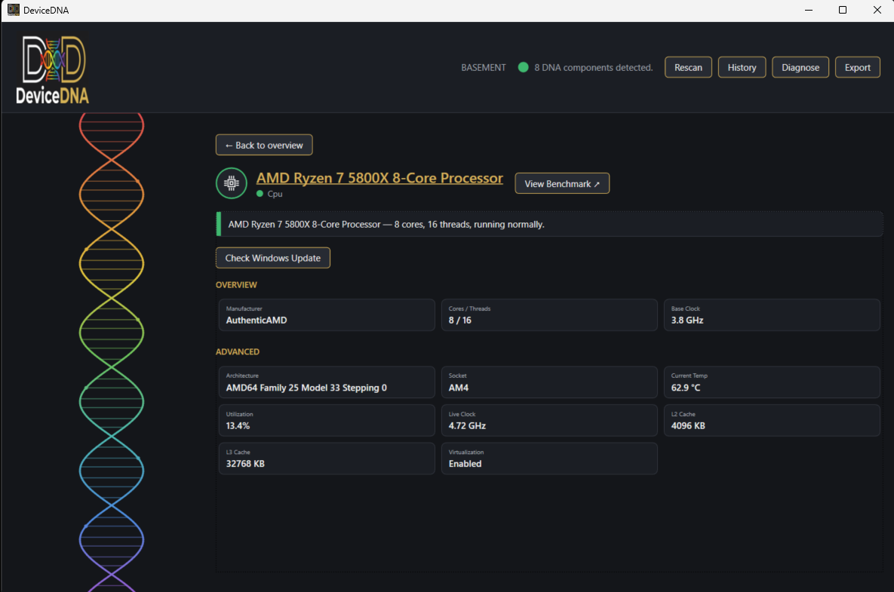
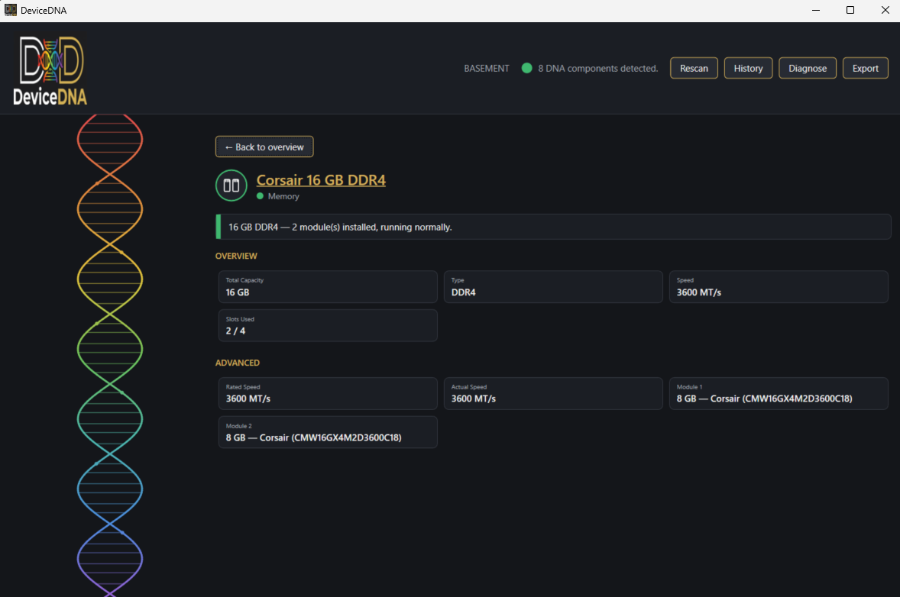
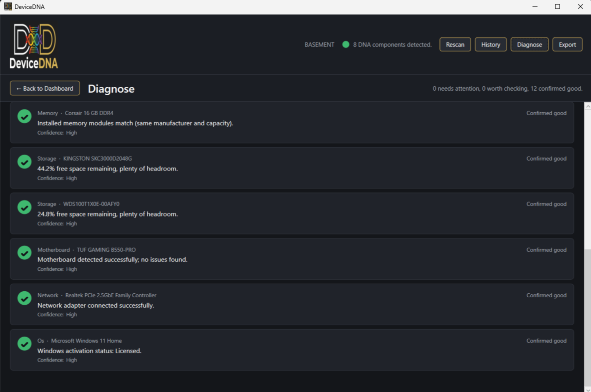

  

<h1 align="center">DeviceDNA</h1>

  <em>Know what's inside your device. Understand what it means.</em> 
  As deep as you want. As simple as you need.

---

DeviceDNA is a native Windows desktop app that scans your PC's hardware — CPU, GPU, Memory,
Storage, Motherboard, Network, and OS — and explains what it finds in plain English, not just
raw numbers. Inspired by tools like Speccy, but it goes further: DeviceDNA tells you what a
reading actually *means* (is this temperature fine? is this driver current? is this normal for
this hardware?), tracks how your machine changes over time, and never sends your data anywhere.

## Features

- **Discover** — scans and identifies all installed hardware across 7 component categories
- **Understand** — a one-line, plain-English summary for every component, with progressive
  Basic → Advanced detail on demand
- **Diagnose** — a deterministic rules engine flags real issues (yellow/red) and confirms what's
  healthy (green), with a dedicated Diagnose page — never AI-guessed, never a fabricated number
- **Changes** — compares any two past scans and shows a "what changed" timeline: driver updates,
  new/removed devices, capacity and speed changes
- **History** — every scan is saved locally, browsable and filterable
- **Export** — full JSON export of everything DeviceDNA detected
- **Optional online lookups** — one-click links to the real vendor product/support page for every
  component (CPU, GPU, Memory, Motherboard, Network, OS, Storage), a community benchmark-database
  link for CPU, plus an opt-in Windows Update driver check — all strictly user-triggered, never
  automatic

## Privacy

Your scan data never leaves your device. Scan history lives in a local SQLite database on your
own machine — no accounts, no telemetry, no cloud sync. The only network activity DeviceDNA ever
performs is a lookup you explicitly click for (a vendor page link, or a Windows Update check),
never anything automatic on a routine scan.

## Screenshots

   
  <em>The orbital dashboard — one node per hardware component, real-time health at a glance.</em>

  
  

  <em>Full detail view for CPU (live temp/clock, per-core load) and Memory (per-module breakdown, rated vs. actual speed).</em>

   
  <em>Diagnose — every rule that passed and failed, in plain English, not just a score.</em>

## Installing

Download the latest `.msi` installer from the [Releases](../../releases) page, run it, and
launch DeviceDNA from the Start Menu. Windows only for now.

DeviceDNA always asks for administrator access (a UAC prompt) when it launches — this is required
for full CPU/GPU sensor access (package temperature, live clock speed), which Windows blocks for
non-elevated apps. If you ever see the app running without that prompt, CPU/GPU temperature and
live clock will read blank rather than show an incorrect value.

## Tech stack

C# / .NET 8, WPF. Hardware sensor data via
[LibreHardwareMonitorLib](https://github.com/LibreHardwareMonitor/LibreHardwareMonitor)
(MPL-2.0, used unmodified), static inventory via WMI, local history via SQLite. See
`THIRD-PARTY-NOTICES.md` for full license details on everything DeviceDNA depends on.

## License

All Rights Reserved © 2026 nobody174 — see [`LICENSE`](LICENSE). You're welcome to download and
use DeviceDNA freely. The source is here for transparency, not for reuse: no permission is
granted to copy, modify, or redistribute it. Found a bug or have an idea? Open an issue, leave a
comment, or email me — I'd rather hear about it than have it forked.

- Author: nobody174 ([nobodylearn174@gmail.com](mailto:nobodylearn174@gmail.com))
- Patreon: https://www.patreon.com/c/Nobody174

---

*Built with assistance from __Claude Code__ by Anthropic.*
